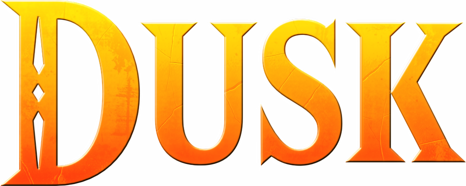
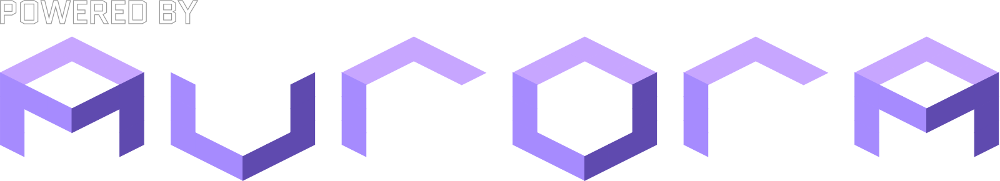

  

  

    <a href="https://twilitrealm.dev">Official Website</a>
    •
    <a href="https://discord.gg/6NpMhefCK9">Discord</a>
  

# Overview

Dusklight is a reverse-engineered reimplementation of Twilight Princess.

It aims to be as accurate as possible to the original while also providing new options, enhancements, and tools to customize your experience.

# Features

- **PS5 DualSense Controller Enhancements (Native):**
  - **Adaptive Triggers (L2 / R2):** Heavy mechanical pull tension during Iron Boots walking, tactical resistance on Left Trigger during target lock (Z-targeting), and dynamic string pull tension during archery/slingshot (Right Trigger) with realistic snap release.
  - **Dynamic Health LED Lightbar:** Gamepad LEDs pulse breathing red when health drops to 2 hearts ($dComIfGs\_getLife() \le 8$) or lower, matching tunic colors and targeting reticles under normal conditions.
  - **Settings Toggle & Compatibility Fallback:** Toggleable at will via the *Input* Settings menu; automatically disables and falls back to standard trigger behaviors if using a non-PS5 gamepad.

# Setup

> [!IMPORTANT]
> Dusklight does *not* provide any copyrighted assets. You must provide your own copy of the original game.

> [!IMPORTANT]
> At a minimum, Dusklight requires a GPU with support for either D3D12, Vulkan, or Metal. Your experience with specific hardware, operating systems, and drivers may vary. In particular, older Intel iGPUs have a high likelihood of incompatibility. We are also aware of a number of issues on devices with Adreno GPUs and are working to resolve them.

### 1. Verify your dump

First, make sure your dump of the game is clean and supported by Dusklight. You can do this by checking the SHA-1 hash of your dump against this list of supported versions:

| Version      | SHA-1 hash                                 |
|--------------| ------------------------------------------ |
| GameCube USA | `75edd3ddff41f125d1b4ce1a40378f1b565519e7` |
| GameCube EUR | `2601822a488eeb86fb89db16ca8f29c2c953e1ca` |

*Support for other versions of the game is planned in the future.

### 2. Download [Dusklight](https://github.com/TwilitRealm/dusklight/releases)

### 3. Setup the game
**Windows / macOS / Linux**
- Extract the .zip file
- Launch Dusklight
- Press **Select Disc Image** and provide the path to your supported game dump
- Press **Play**!

**iOS**
- Follow the [iOS setup guide](docs/ios-install-altstore.md)

**Android**
- Install the Dusklight APK
- Launch Dusklight
- Press **Select Disc Image** and provide the path to your supported game dump
- Press **Play**!

# Building

If you'd like to build Dusklight from source, please read the [build instructions](docs/building.md).

Pull requests are welcomed! Note that we do not accept contributions that are primarily AI-generated and will close your PR if we suspect as much. Please also see the [code conventions](docs/code-conventions.md).

# Credits

Special thanks to the [TP decompilation](https://github.com/zeldaret/tp) team, the GC/Wii decompilation community, the [Aurora](https://github.com/encounter/aurora) developers, the [TP speedrunning community](https://zsrtp.link), and all [contributors](https://github.com/TwilitRealm/dusklight/graphs/contributors).

 

    

